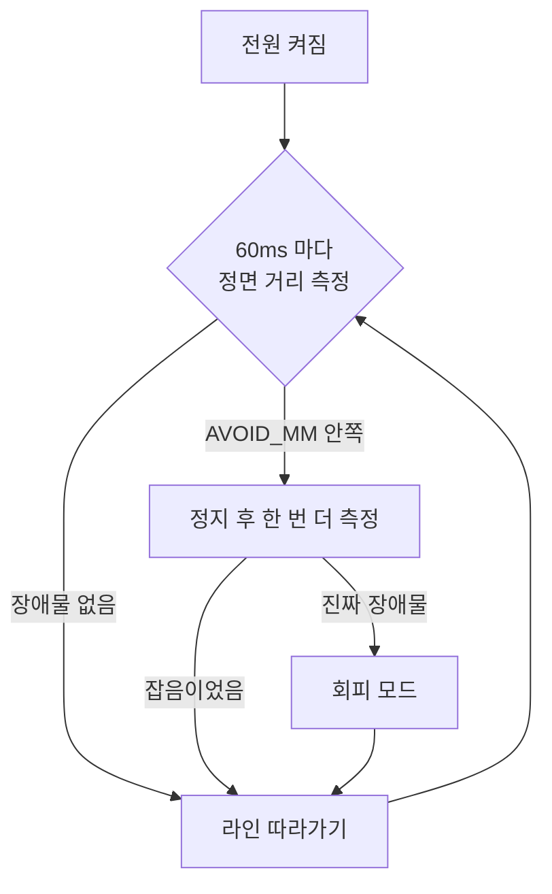
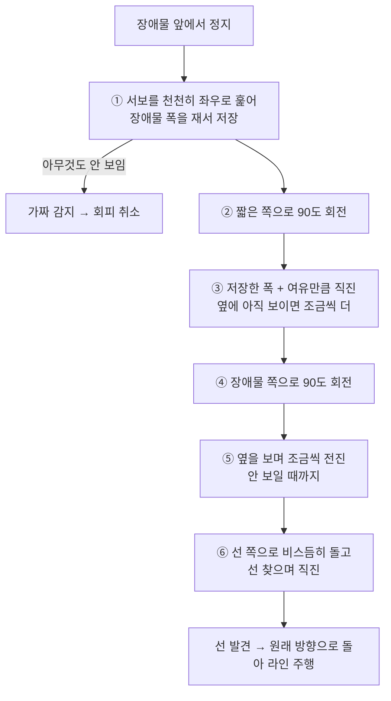
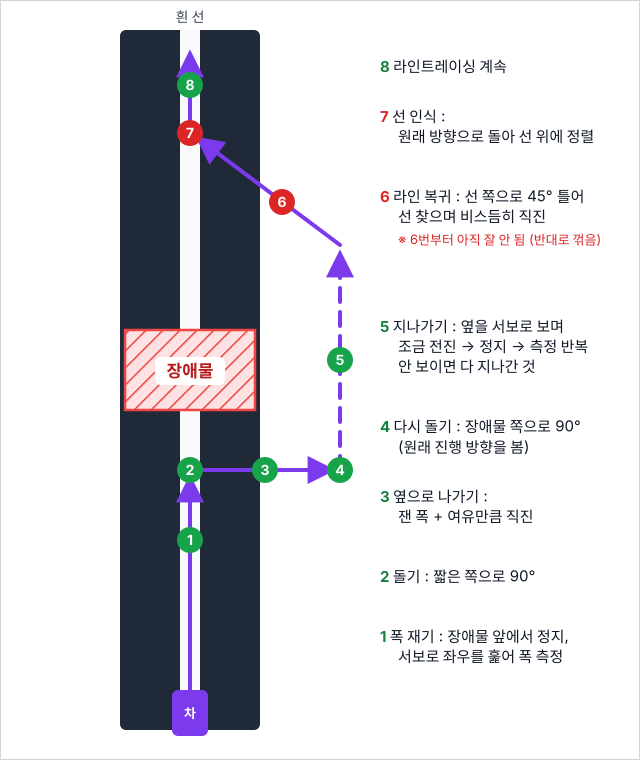

# 🚗 4WD RC카 — 라인트레이서 + 초음파 장애물 회피

> **⚠️ 미완성 / 튜닝 중** — 회피 주행 값을 아직 맞추는 중입니다.

아두이노 우노로 만든 4륜 RC카입니다. 흰 선을 따라 달리다가 장애물을 만나면,
**초음파 센서 하나와 서보 하나만으로** 장애물 크기를 재고 옆으로 돌아서 다시 선으로 복귀합니다.

엔코더도 IMU도 없어서 "얼마나 갔는지 / 몇 도 돌았는지"를 전부 시간으로 추정합니다.

---

## 🧩 구성

| 부품 | 핀 | 용도 |
|---|---|---|
| 라인센서 ×3 | A5(왼쪽) · A4(가운데) · A3(오른쪽) | 흰 선 = `0`, 검은 바탕 = `1` |
| 초음파 센서 | Trig 13 · Echo 12 | 장애물까지 거리(mm) |
| 서보 | 2 | 초음파 센서를 좌우로 돌림 |
| 모터 드라이버 | PWM 5 · 6 / 방향 8 · 9 · 10 · 11 | 좌우 바퀴 |

---

## 🔁 전체 흐름



라인센서는 쉬지 않고 계속 읽고, 초음파는 60ms 마다만 쏩니다.
(너무 자주 쏘면 앞에 쏜 소리의 메아리가 섞여서 가짜 값이 나옵니다.)

---

## 〰️ 라인 따라가기

센서 3개 값(왼쪽, 가운데, 오른쪽)의 조합으로 동작을 고릅니다.

| 왼쪽 | 가운데 | 오른쪽 | 동작 |
|:---:|:---:|:---:|---|
| 1 | 0 | 1 | 직진 |
| 1 | 0 | 0 | 왼쪽으로 살짝 |
| 1 | 1 | 0 | 제자리 좌회전 |
| 0 | 0 | 1 | 오른쪽으로 살짝 |
| 0 | 1 | 1 | 제자리 우회전 |
| 0 | – | 0 | 정지 |
| 1 | 1 | 1 | 선 놓침 → 하던 동작 유지, 20초 지나면 정지 |

---

## 🧱 장애물 회피 알고리즘

핵심은 **"먼저 재고, 그다음에 움직인다"** 입니다.
움직이면서 그때그때 본 값으로 판단하면 센서 값이 한 번만 튀어도 엉뚱하게 꺾이기 때문입니다.



오른쪽으로 피하는 경우를 위에서 본 그림입니다. 차는 아래에서 위로 선을 따라 달립니다.
왼쪽으로 피할 때는 좌우만 뒤집힌 같은 경로입니다.

<p align="center">
  
</p>

> **🚧 아직 잘 안 되는 부분** — **5번(지나가기) 단계에서 차가 반대 방향으로 갑니다.**
> 원인 확인 중이며, 이 단계부터 뒤(5번·6번)는 아직 믿을 수 없습니다.

### 단계별 설명

1. **폭 재기** — 서보를 정면 기준 ±70도까지 10도씩 천천히 돌리며 거리를 잽니다.
   장애물로 보이는 각도에서 `거리 × sin(각도)` 로 좌우로 뻗은 길이를 구해 저장합니다.
2. **돌기** — 왼쪽·오른쪽 중 짧게 뻗은 쪽으로 90도 돕니다. 이제 장애물은 차의 옆에 있습니다.
3. **옆으로 나가기** — 저장한 폭 + 여유만큼은 무조건 직진합니다. 그 뒤에도 옆에 장애물이 보이면 6cm씩 더 갑니다.
4. **다시 돌기** — 장애물 쪽으로 90도 돌아 원래 진행 방향으로 섭니다. 장애물은 여전히 같은 쪽 옆에 있습니다.
5. **지나가기** — 서보로 옆을 보면서 6cm 전진 → 정지 → 측정을 반복합니다. 옆에 안 보이면 다 지나간 것입니다.
6. **복귀** — 선 쪽으로 45도 돌아 직진하다가, 라인센서가 선을 보면 원래 방향으로 돌아 라인 주행을 이어갑니다.

### 지키는 규칙

- **서보로 잴 때는 반드시 멈춘 상태** — 측정 함수(`lookAt`)가 무조건 먼저 정지하고, 차가 완전히 설 때까지 기다린 뒤 잽니다.
- **가짜 값 거르기** — 20mm 미만 값은 버리고(센서가 잴 수 없는 거리), 장애물이 보이면 한 번 더 재서 확인합니다.
- **멈춰 서지 않기** — 회피가 끝났는데 선이 안 보이면 전진하면서 찾습니다.

---

## 🎛️ 튜닝

조절하는 값은 전부 `RC_CAR_All.ino` 맨 위 **`[설정]`** 블록에 있습니다. 먼저 맞춰야 하는 값은 두 개입니다.

| 값 | 뜻 | 맞추는 법 |
|---|---|---|
| `TURN_90_MS` | 제자리에서 90도 도는 시간(ms) | 덜 돌면 올리고, 더 돌면 내리기 |
| `MM_PER_SEC` | 1초에 가는 거리(mm) | 로그의 "간 거리"와 실제 거리를 자로 재서 비교 |

건전지가 약해지면 두 값 모두 다시 맞춰야 합니다.

그 밖에 자주 만지는 값입니다.

| 값 | 뜻 |
|---|---|
| `AVOID_MM` | 이 거리 안에 장애물이 보이면 회피 시작 |
| `AVOID_SIDE` | `0` 자동 · `1` 무조건 오른쪽 · `2` 무조건 왼쪽 (한쪽씩 테스트할 때) |
| `SERVO_FLIP` | 서보 좌우가 반대로 달렸으면 `1` |
| `SIDE_MARGIN_MM` | 옆으로 나갈 때 장애물 폭에 더하는 여유. 긁히면 늘리기 |
| `PASS_EXTRA_MM` | 장애물이 안 보이게 된 뒤 더 가는 거리 |

---

## 🪵 디버그 로그

시리얼 모니터를 **9600 baud** 로 열면 상태가 계속 찍힙니다. (`DEBUG = 0` 으로 끌 수 있습니다.)

```
[주행] 거리 291 | 라인 1,0,1 | 동작 직진
[장애물] 거리 233 -> 회피 모드 시작
  각도 -40 : 286
  각도 0 : 220
  각도 40 : 259
[회피 1] 장애물 왼쪽 183 / 오른쪽 166 mm
=== 오른쪽 회피 ===
[R 2] 오른쪽으로 돎 (장애물은 왼쪽)
    간 거리 60 | 옆 거리 390 -> 보임, 살짝 전진
[R 3-2] 장애물 지나감. 간 거리 450
[4] 선 발견 -> 원래 방향으로 돌기
```

| 로그 | 뜻 |
|---|---|
| `=== 시작 ===` 이 주행 중에 또 나옴 | 전원이 순간 끊겨 리셋됨 (서보·모터 전류, 건전지 확인) |
| `[장애물?] … 잡음, 무시` | 가짜 값이라 회피하지 않음 |
| `[4] 선 못 찾음` | 복귀 각도·거리(`RETURN_TURN_DEG`, `RETURN_MAX_MM`) 조절 필요 |

---

## 📌 할 일

- [ ] **5번(지나가기) 단계에서 반대 방향으로 가는 문제 해결** ← 지금 막힌 곳
- [ ] `TURN_90_MS` · `MM_PER_SEC` 실제 차에 맞추기
- [ ] 오른쪽 회피 / 왼쪽 회피 각각 확인
- [ ] 회피 뒤 선으로 복귀 확인
- [ ] 튜닝 끝나면 디버그 출력 정리, 좌우 회피 함수 하나로 합치기
